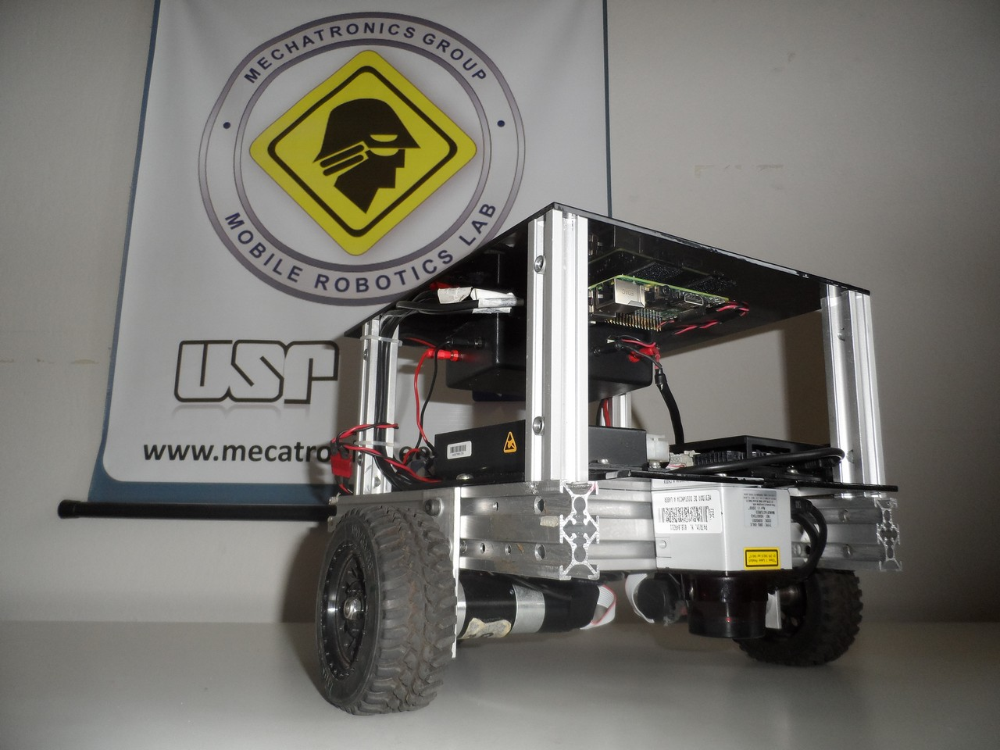

# Introdução de ROS e robôs móveis terrestres

Até o momento, fizemos o [primeiro subscritor](https://bitbucket.org/grupomecatronica/gmr_intro) e mexemos com [parâmetros e roslaunch](https://bitbucket.org/grupomecatronica/gmr_intro_1) sem nos importar com a aplicação em si. O que temos aqui é um robô com tração diferencial (*differential drive robot*) cujas velocidades angulares dos motores são publicadas em rotações por minuto [rpm] e cujos parâmetros conhecidos são: a) raio da roda (*/wheel_radius*); b) relação de transmissão devido à caixa de redução entre o motor e a roda (*/gear_ratio*); c) pista do eixo/distância transversal entre o centro das rodas. Um robô com tração diferencial é bastante simples (Figura 1): duas rodas atuadas independentemente e presença de apoios/rodízios para o equilíbrio tridimensional do robô.

 
 
 **Figura 1**: Exemplo de robô com tração diferencial

Com base na informação das velocidades dos motores, queremos saber a posição do robô no espaço, que para robôs terrestres móveis podemos simplificar para o caso 2D, então queremos *(x, y, &theta;)*, em que *(x, y)* é a posição cartesiana e &theta; é o ângulo para o qual a frente do robô está apontada. Usaremos o modelo do monociclo em que o conjunto dos motores são reduzidos a uma única roda que tem velocidade linear na direção em que rola e velocidade angular em torno do próprio eixo, como podemos ver na Figura 2.

 
 
 **Figura 2**: Transformação de tração diferencial para modelo de monociclo

em que temos um eixo (x,y) global e fixo, um eixo (x<sub>r</sub>, y<sub>r</sub>) do robô local, fixo ao seu centro de rotação e com x<sub>r</sub> apontando para a sua frente,  v<sub>r</sub> é a velocidade linear da roda direita (positiva no sentido positivo de x<sub>r</sub>), v<sub>l</sub> é a velocidade linear da roda esquerda (positiva no sentido positivo de x<sub>r</sub>) e L é o comprimento da pista do eixo. Sobre o monociclo equivalente, temos que v<sub>x</sub> é a velocidade linear no eixo x<sub>r</sub>, w<sub>z</sub> é a velocidade angular em torno do próprio eixo, portanto rotação em torno do eixo z<sub>r</sub>, e &theta; é o ângulo entre uma reta paralela ao eixo x global e o eixo x<sub>r</sub>. Seguimos que a velocidade linear e angular do monociclo podem ser expressas em função das velocidades dos motores do robô:

v<sub>x</sub> = (v<sub>r</sub>  + v<sub>l</sub> )/2 (Eq. 1)
w<sub>z</sub>  = (v<sub>r</sub>  - v<sub>l</sub> )/L (Eq. 2)

Temos que as velocidades do monociclo no eixo (x,y) são dadas por (x', y'):

x' = v<sub>x</sub> cos&theta; (Eq. 3)
y' = v<sub>x</sub> sin&theta; (Eq. 4)
&theta;' = w<sub>z</sub> dt (Eq. 5)

em que dt é o intervalo de tempo que o robô permaneceu naquela velocidade, ou seja, o tempo entre duas medições de velocidades de motores, e portanto, atualização das velocidades do monociclo. Temos, finalmente, que a posição do robô é resultado da integração no tempo das Eqs. 3, 4 e 5:

x(t) = x(t-1) + v<sub>x</sub> cos&theta; (Eq. 6)
y(t) = y(t-1) + v<sub>x</sub> sin&theta; (Eq. 7)
&theta;(t) = &theta;(t-1) + w<sub>z</sub> dt (Eq. 8)

*Note que temos velocidade de rotação de motor em rpm e não velocidade linear em m/s como necessário para as Eqs. 1 e 2. Portanto, é necessário converter:*

v = w_rpm / T * R * 2&pi;/60 (Eq. 9)

em que v é a velocidade linear em m/s, w_rpm é a velocidade de rotação do motor em rpm, T é a relação de transmissão e R é o raio da roda.

Nosso objetivo é subscrever às leituras de velocidade de motor (*/left_rpm* e */right_rpm*) e, a partir delas, publicar a posição estimada do robô. Apesar de ainda simples, nos prepararemos para projetos maiores com ROS. Uma boa prática é a utilização de classes. Neste tutorial, reescreveremos o [primeiro subscritor](https://bitbucket.org/grupomecatronica/gmr_intro) utilizando programação orientada a objetos (POO). O nó resultante será utilizado nos próximos tutoriais.

**Embora os códigos já estejam disponíveis neste repositório, só os utilize de referência e siga o tutorial para criar o seu pacote. Criar as pastas/arquivos e digitar o código manualmente são fundamentais para entender melhor como é a estrutura de um pacote e as particularidades das funções.**

Criaremos o pacote com as dependências necessárias
```console
user@pc:~/ros_ws/src$ catkin_create_pkg gmr_intro_poo roscpp std_msgs
```
Descomentaremos/adicionaremos as seguintes linhas no arquivo gmr_intro_poo/CMakeLists.txt:
```
add_executable(${PROJECT_NAME}_node src/gmr_intro_poo_node.cpp)
target_link_libraries(${PROJECT_NAME}_node
    ${catkin_LIBRARIES}
)
```
colocaremos nosso código principal em gmr_intro_poo/src/gmr_intro_poo_node.cpp:

```cpp
#include <gmr_intro_poo/gmr_intro_poo.hpp>

int main(int argc, char **argv)
{
    // Inicialização da ROS no contexto deste nó
    ros::init(argc, argv, "gmr_intro_poo_node");
    ros::NodeHandle nh("~");
    // Criação de uma instância da classe RobotClass em que 
    // um ponteiro a ros::NodeHandle é passado como argumento
    RobotClass robot(&nh);
    // Loop de ROS para manter o nó vivo
    ros::spin();
}

```
Colocaremos a declaração da nossa classe RobotClass em arquivos separados como forma de boa prática. Teremos o cabeçalho em gmr_intro_poo/include/gmr_intro_poo/gmr_intro_poo.hpp e a implementação em gmr_intro_poo/src/gmr_intro_poo.cpp. No código acima, note a inclusão do cabeçalho da classe:
```cpp
#include <gmr_intro_poo/gmr_intro_poo.hpp>
```
e que na criação da instância, passamos o `nh`, nosso ros::NodeHandle:
```cpp
RobotClass robot(&nh);
```

Devido à necessidade dos dois novos arquivos, editaremos gmr_intro_poo/CMakeLists.txt novamente. Para o cabeçalho, descomente a linha 118 para que a pasta include seja checada durante a compilação:
```
include_directories(
  include
  ${catkin_INCLUDE_DIRS}
)
```
e para a implementação, altere a linha de *add_executable* para que também use o cpp referente à implementação da classe na hora de gerar o executável/nó:
```
add_executable(${PROJECT_NAME}_node src/gmr_intro_poo_node.cpp src/gmr_intro_poo.cpp)
```

Agora, escreveremos o cabeçalho. Crie o arquivo gmr_intro_poo.hpp em gmr_intro_poo/include/gmr_intro_poo. Ele conterá as seguintes linhas:

```cpp
#include <ros/ros.h>
#include <std_msgs/Float32.h>
#include <string>

class RobotClass
{
    public:
        RobotClass(ros::NodeHandle* nh);

    private:
        void                subLeft(const std_msgs::Float32::ConstPtr &msg);
        void                subRight(const std_msgs::Float32::ConstPtr &msg);

        ros::NodeHandle*    _nh;
        ros::Subscriber     _sub_left;
        ros::Subscriber     _sub_right;

        struct Params
        {
            double          axle_track;
            double          gear_ratio;
            double          wheel_radius;
            std::string     topic_name_left_rpm;
            std::string     topic_name_right_rpm;
        }_params;

        struct Vel_m_s
        {
            double          left;
            double          right;
        }_vel_m_s;
};
```
Colocamos as bibliotecas necessárias, por exemplo as relacionadas à mensagem que receberemos. Deixamos o construtor da classe RobotClass público e note que aquilo que não deve ser acessado fora da classe deve ser colocada como membro privado. Isso inclui, por exemplo, os subscritores e suas funções de callback além das variáveis de parâmetro. Uma sugestão é o uso de structs para agrupar variáveis da mesma categoria como podemos ver para o caso das struct Params e Vel_m_s. E a implementação fica em gmr_intro_poo/src/gmr_intro_poo.cpp:
```cpp
#include <gmr_intro_poo/gmr_intro_poo.hpp>

RobotClass::RobotClass(ros::NodeHandle* nh)
{
    _nh = nh;
    _nh->param<std::string>("nome_topico_left_rpm", _params.topic_name_left_rpm, "/left_rpm");
    _nh->param<std::string>("nome_topico_right_rpm", _params.topic_name_right_rpm, "/right_rpm");
    _nh->param("/axle_track", _params.axle_track, 1.0);
    _nh->param("/gear_ratio", _params.gear_ratio, 1.0);
    _nh->param("/wheel_radius", _params.wheel_radius, 1.0);

    _sub_left = _nh->subscribe(_params.topic_name_left_rpm, 1, &RobotClass::subLeft, this);
    _sub_right = _nh->subscribe(_params.topic_name_right_rpm, 1, &RobotClass::subRight, this);

    _vel_m_s.left = 0.0;
    _vel_m_s.right = 0.0;    
}
void RobotClass::subLeft(const std_msgs::Float32::ConstPtr &msg)
{
    _vel_m_s.left = msg->data/_params.gear_ratio*_params.wheel_radius*2*M_PI/60.0;
    ROS_INFO_STREAM( "velocidade linear esquerda: " << _vel_m_s.left );
}
void RobotClass::subRight(const std_msgs::Float32::ConstPtr &msg)
{
    _vel_m_s.right  = msg->data/_params.gear_ratio*_params.wheel_radius*2*M_PI/60.0;
    ROS_INFO_STREAM( "velocidade linear direita: " << _vel_m_s.right );
}
```

Note que o construtor recebe o ponteiro de ros::NodeHandle, aloca para um membro privado `_nh`, faz a importação de parâmetros e inicialização dos subscritores. Na importação de parâmetros, utilizamos uma função template:
```cpp
void ros::param::param 	( 	const std::string &  	param_name,
		                    T &  	param_val,
		                    const T &  	default_val	 
	                    ) 
``` 

então temos a possibilidade de explicitamente definir o tipo:

```cpp
    _nh->param<std::string>("nome_topico_left_rpm", _params.topic_name_left_rpm, "/left_rpm");
```

ou passar todos os argumentos como <std::string>. Note que para o compilador, o argumento `"/left_rpm"` é interpretado como char[10] e, portanto, há conflito na dedução do tipo necessário para a chamada da função:

```cpp
    _nh->param("nome_topico_left_rpm", _params.topic_name_left_rpm, std::string("/left_rpm"));
```

 Observe que a inicialização dos subscritores é diferente de quando o subscritor foi escrito sem POO: eram três argumentos e agora são quatro. Agora também é necessário passar uma referência à classe com o uso da keyword `this`.

```cpp
    _sub_left = _nh->subscribe(_params.topic_name_left_rpm, 1, &RobotClass::subLeft, this);
```

A função callback faz parte da classe, o que permite o acesso a atributos privados, e.g. _vel_m_s. Assim, como não conseguimos passar (facilmente) ponteiros/referências a uma função callback que também é uma função void portanto não retorna nada, o uso de POO elimina o uso de variáveis globais para fazer uma cópia da mensagem recebida.

```cpp
void RobotClass::subRight(const std_msgs::Float32::ConstPtr &msg)
{
    _vel_m_s.right  = msg->data/_params.gear_ratio*_params.wheel_radius*2*M_PI/60.0;
    ROS_INFO_STREAM( "velocidade linear direita: " << _vel_m_s.right );
}
```

Para facilitar, podemos fazer um arquivo launch. Crie a pasta gmr_intro_poo/launch e o arquivo robot.launch:

```xml
<launch>

  <param name="axle_track" value="0.5"/>
  <param name="gear_ratio" value="20"/>
  <param name="wheel_radius" value="0.05"/>
  <param name="gaussian_noise_mean" value="0.0"/>
  <param name="gaussian_noise_stddev" value="1.0"/>
  
  <node pkg="gmr_intro" type="gmr_intro_node" name="gmr_intro_node" output="screen">
  </node>
  
  <node pkg="gmr_intro_poo" type="gmr_intro_poo_node" name="gmr_intro_poo_node" output="screen">
    <param name="nome_topico_left_rpm" value="/left_rpm"/>
    <param name="nome_topico_right_rpm" value="/right_rpm"/>
  </node>

</launch>
```
Esse arquivo launch inicializa os parâmetros globais, o nó que representa o robô e o nosso último nó criado. Observe que temos dois parâmetros internos ao gmr_intro_poo_node. 

Agora, é só compilar
```console
user@pc:~/ros_ws: $catkin_make
```

e rodar o arquivo launch:
```console
user@pc:~/ros_ws: $roslaunch gmr_intro_poo robot.launch
```

Você observará uma saída como:
```console
[ INFO] [1586802671.659690540]: velocidade linear direita: 0.0152419
[ INFO] [1586802671.679258806]: velocidade linear esquerda: 0.0195268
[ INFO] [1586802671.679293068]: velocidade linear direita: 0.0119513
[ INFO] [1586802671.698956397]: velocidade linear esquerda: 0.015518
[ INFO] [1586802671.698993803]: velocidade linear direita: 0.0173114
[ INFO] [1586802671.718825862]: Toggle
[ INFO] [1586802671.719135842]: velocidade linear esquerda: -0.078665
[ INFO] [1586802671.719173403]: velocidade linear direita: 0.080252
[ INFO] [1586802671.741243202]: velocidade linear esquerda: -0.0843489
[ INFO] [1586802671.741294414]: velocidade linear direita: 0.0813423
[ INFO] [1586802671.761619095]: velocidade linear esquerda: -0.0828073
[ INFO] [1586802671.761669829]: velocidade linear direita: 0.0775911
[ INFO] [1586802671.781556323]: velocidade linear esquerda: -0.0797102
[ INFO] [1586802671.781707650]: velocidade linear direita: 0.0742102
[ INFO] [1586802671.801595507]: velocidade linear esquerda: -0.0900717
[ INFO] [1586802671.801745003]: velocidade linear direita: 0.0727602
[ INFO] [1586802671.819543203]: velocidade linear esquerda: -0.0725262
[ INFO] [1586802671.819596358]: velocidade linear direita: 0.0799561
[ INFO] [1586802671.844074559]: velocidade linear esquerda: -0.0785592
[ INFO] [1586802671.844254377]: velocidade linear direita: 0.0757865
[ INFO] [1586802671.859634098]: velocidade linear esquerda: -0.0782231
[ INFO] [1586802671.859684363]: velocidade linear direita: 0.0778707
```
devido ao atributo `output="screen"` que colocamos em ambos os nós.

Por enquanto, só utilizamos a Eq. 9 já que só fizemos a conversão do valor recebido em rpm para m/s. No próximo tutorial, acrescentaremos um publicador da posição do robô à classe RobotClass e, portanto, utilizaremos as outras equações.


Contato: Akihiro (akihirohh@gmail.com)

Apoio da Fundação de Amparo à Pesquisa do Estado de São Paulo (FAPESP) através do processo nº 2018/10894-2. 
As opiniões, hipóteses e conclusões ou recomendações expressas neste material são de responsabilidade do(s) autor(es) e não necessariamente refletem a visão da FAPESP.