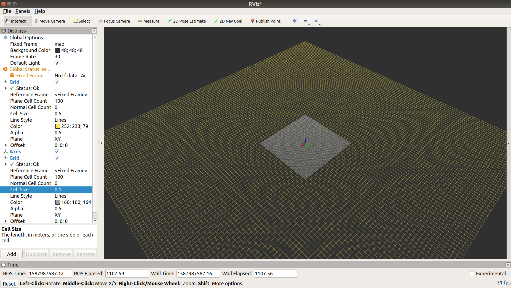
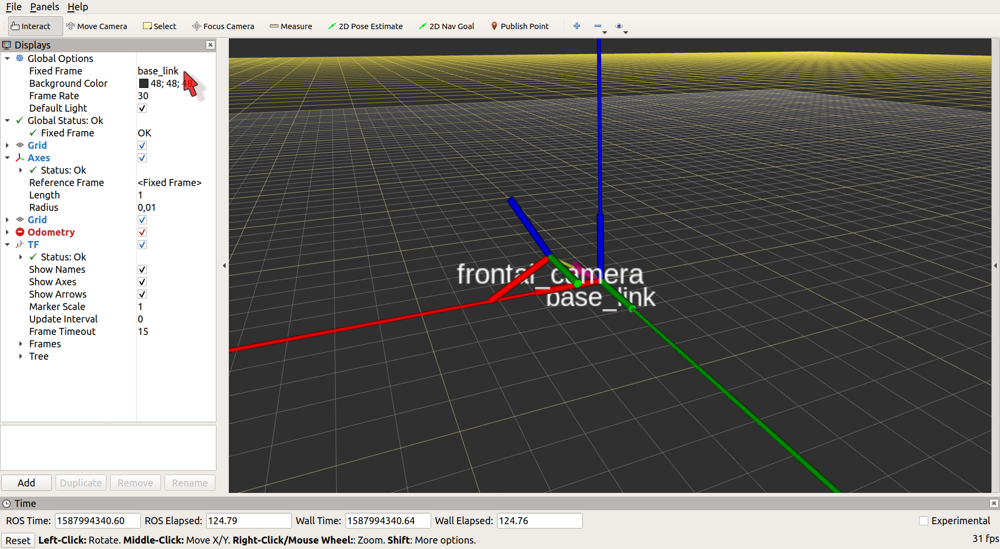
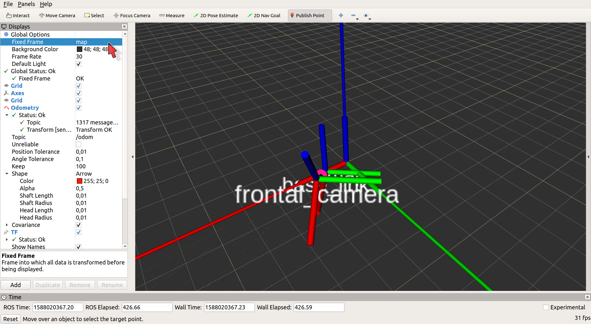
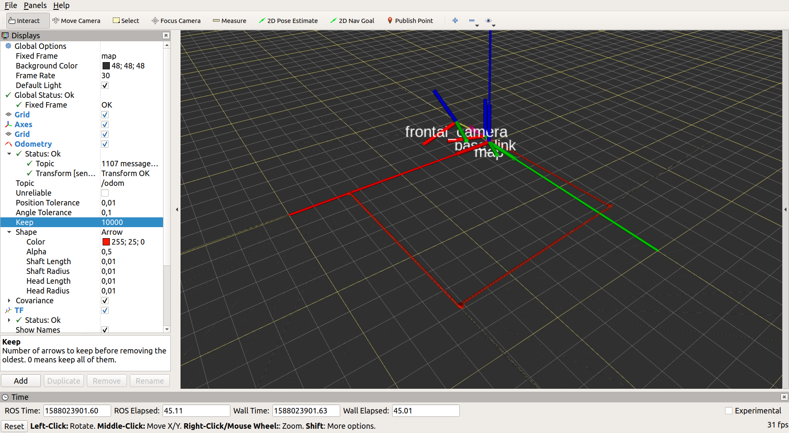

# Introdução de ROS e robôs móveis terrestres

Criamos um [serviço](https://bitbucket.org/grupomecatronica/gmr_intro_4) em nossa classe RobotClass para "parar" o robô ao nosso comando. Também conseguimos saber onde o robô está a partir da [odometria](https://bitbucket.org/grupomecatronica/gmr_intro_3), o tópico `odom`. Mas só pelo `rostopic echo` não é nada fácil ver o caminho que o robô está fazendo, certo? E, exatamante para a visualização de tópicos, ROS possui [Rviz](http://wiki.ros.org/rviz). Vamos conhecer essa ferramenta.

## Rviz

O nosso objetivo é ver a trajetória percorrida pelo robô. Primeiro, vamos deixar o robot.launch rodando:
```console
user@pc:~$ roslaunch gmr_intro_poo robot.launch
```
Queremos ver onde o robô está a cada instante, portanto queremos visualizar `/odom`. Para abrir o Rviz, é necessário que haja um master rodando (`roscore` ou o master aberto com `roslaunch`). Portanto, vamos primeiro deixar um master ativo numa sessão de terminal e em outra sessão, abra o Rviz com:

```console
user@pc:~$ rviz
```
Temos *Displays* no lado esquerdo. Observe que podemos alterar os elementos existentes. Por exemplo, em Grid, podemos aumentar a quantidade de células em *Grid/Plane Cell Count*, o tamanho de cada em *Grid/Cell Size* e a cor em *Grid/Color*. *Alpha* se refere à transparência do elemento, sendo 0 invisível e 1 totalmente opaco. Um valor intermediário permite visualizar elementos sobrepostos, o que é bastante comum. 

Na região esquerda inferior do Rviz, encontraremos o botão *Add*. Ao apertá-lo, um pop-up surgirá e poderemos criar uma visualização *By display type* ou *By topic*. O primeiro é útil para criar elementos que não estão sendo publicados por algum nó, mas que pode nos ajudar. Por exemplo, criar um Axes para saber a origem e as direções dos eixos coordenados. Ou até mesmo criar um Grid secundário para refinar a nossa visualização. Um exemplo é mostrado abaixo na Figura 1.

 
 **Figura 1**: exemplo de Grid original alterado e inclusão de Axes + Grid secundário no Rviz

Vamos adicionar o tópico que desejamos: em Add/By topic, escolha Odometry dentro de /odom. Veremos que o elemento aparece com uma bola vermelha com um negativo dentro. Abrindo o elemento, podemos ver que há um *Status:Error* e em *Transform [sender=unknown_publisher]* temos a seguinte mensagem: `For frame []: Fixed Frame [map] does not exist`. Esse é um dos bugs comuns quando tentamos visualizar algo no Rivz: a definição errada ou faltante dos sistemas coordenados. Antes de visualizar /odom, precisamos ver um pouco sobre *tf2*.

## Os sistemas coordenados (tf2)

O conjunto de pacotes [tf2](http://wiki.ros.org/tf2) permite saber a relação entre os diversos sistemas coordenados. Vamos considerar o nosso robô. Imaginemos que ele está dentro de um galpão. Em um dos cantos colocamos um sistema coordenado global, que nos permite correlacionar pares coordenados (x,y) com  características do galpão. Temos ainda então um sistema coordenado do robô (x<sub>r</sub>, y<sub>r</sub>), que é fixo em seu centro de gravidade (CG). Devido aos encoders nos motores, conseguimos calcular a velocidade linear no eixo x<sub>r</sub> e a velocidade angular no eixo z<sub>r</sub> (Figura 2). Para saber a posição do robô no eixo global, utilizamos as equações 3, 4 e 5 das [equações cinemáticas do robô com tração diferencial](https://bitbucket.org/grupomecatronica/gmr_intro_2), copiadas abaixo para conferência.

x' = v<sub>x</sub> cos&theta; (Eq. 3)
y' = v<sub>x</sub> sin&theta; (Eq. 4)
&theta;' = w<sub>z</sub> dt (Eq. 5)


 
 
 **Figura 2**: Observe a existência de um sistema coordenado global (x,y) e um "local" ao robô (x<sub>r</sub>, y<sub>r</sub>)

Portanto, as equações permitem-nos associar os dois sistemas coordenados. Além desses sistemas, podemos pensar nos sensores embarcados e partes móveis dentro do próprio robô como um braço. No caso dos sensores, a correta definição de seus sistemas coordenados em relação do robô é fundamental para que as leituras sejam corretamente visualizadas e, principalmente, utilizadas nos sistemas de percepção. Vamos considerar uma câmera na parte frontal do robô. Ela está 0,2m do chão (0,1m do CG), centralizada na largura do robô e 0,15m a frente do CG (adotar o centro geométrico). Vamos ainda falar que ela está posicionada com ângulo de 30º para baixo. Adotando que a câmera possui essa configuração de forma estática ao CG e que colocaremos o sistema coordenado como no caso do robô (x na mesma direção em que a câmera filma, y para o lado esquerdo e z para cima), podemos utilizar um nó padrão do pacote **tf2**: 

```
static_transform_publisher x y z yaw pitch roll frame_id child_frame_id
```

em que frame_id é a string que representa o sistema coordenado pai, ou seja, o que será usado de referência/aquele que **agora** é a origem enquanto child_frame_id é para o sistema coordenado filho, logo aquele que descreveremos a partir do pai. No nosso caso, frame_id representará o CG do robô, que comumente chamamos de `base_link` e child_frame_id representará a câmera, que pode ser `frontal_camera`. Podemos colocar no arquivo gmr_intro_poo/launch/robot.launch:

```xml
<launch>
<node pkg="tf2_ros" type="static_transform_publisher" name="camera2cg" args="0.15 0 0.1 0 0.52359877559 0 base_link frontal_camera" />
</launch>
``` 

Confira o resultado com `rostopic echo /tf_static`. E também podemos visualizar o sistema coordenado associado à câmera. Em Rviz, adicione um novo elemento *Add/rviz/TF*. Notará que na lista de elementos, TF aparece com um sinal de exclamação amarelo e com Status:Warn com as seguintes mensagens: 

**base_link**
No transform from [base_link] to frame [map]
**frontal_camera**
No transform from [frontal_camera] to frame [map]

De fato, ainda não possuímos o frame `map`. A sua relação com `base_link` será criada ao colocarmos as equações de cinemática do robô em um "publicador" de transformação de sistemas coordenados. Não se trata de um publicador de fato porque não utiliza o método `advertise` para ros::Publisher, mas a ideia é a mesma. Por hora, para podermos ver a tf da câmera, vamos no elemento Global Options (primeiro da lista de Displays) e seleciona `base_link` como Fixed Frame. Como o nome indica, Fixed Frame será o eixo coordenado que ficará estático na visualização enquanto os outros se movimentam de acordo. Assim, podemos ter tanto o robô se movimentando pelo mundo ou o mundo se movimentando ao redor do robô. Veja Figura 3 para mais detalhes. 


 
 **Figura 3**: inclusão de TF (mostrará os sistemas coordenados disponíveis) com mudança em Global Options (ver o cursor em vermelho). O raio de Axes foi alterado de 0,1 para 0,01 de modo a facilitar a visualização. Observe que `frontal_camera` retrata a forma que a descrição da câmera no robô.

A hipótese de que o sensor e o CG estão rigidamente interligados pode ser suficiente quando os dois estão fisicamente bem fixos um em relação ao outro. Caso existam folgas, amortecedores, molas, mecanismos de transmissão entre os dois, uma forma mais apropriada é fixar uma IMU (*Inertial Measurement Unit*) no sensor e outra no CG (ou perto/bem fixa e com as devidas transformações). Como é preciso preencher a mensagem correspondente à TF e publicar, a ideia é semelhante a que necessitamos no nosso caso, que é criar a relação entre `map` e  `base_link`.

Continuaremos editando a nossa classe RobotClasse em [gmr_intro_poo](https://bitbucket.org/grupomecatronica/gmr_intro_poo). Dentro de tf2, agora utilizaremos o pacote [tf2_ros](http://wiki.ros.org/tf2_ros). Deveríamos colocá-lo como dependência na hora de criar o pacote `catkin_create_pkg gmr_intro_poo roscpp std_msgs tf2_ros`, mas esta necessidade de colocar todos os pacotes foi sendo alterada com o passar das versões de ROS (basicamente uma por ano desde 2009/2010). Atualmente, muitos pacotes padrões não precisam ser colocados como dependência (e.g. algumas mensagens como std_msgs). A inclusão de roscpp e/ou rospy facilita que o pacote já vem com a organização de arquivos/diretório padrão para cada linguagem. Porém, um pacote menos convencional (nem todo nó precisa) como o tf2_ros precisa ser adicionado como dependência. Para efeito de melhor leitura do código, recomendo sempre colocar as dependências explicitamente. Uma forma é sabendo de antemão e, portanto, colocando as dependências na hora de criar o pacote (catkin_create_pkg). A outra (especialmente para pacotes já criados) é editar o arquivo CMakeLists.txt do pacote. Adicione os pacotes geometry_msgs e tf2_ros em find_package:

```bash
find_package(catkin REQUIRED COMPONENTS
  roscpp
  geometry_msgs
  std_msgs
  tf2_ros
)
```

Vamos editar o arquivo gmr_intro_poo/include/gmr_intro_poo/gmr_intro_poo.hpp, adicionando as bibliotecas necessárias:

```cpp
#include <tf2_ros/transform_broadcaster.h>
#include <geometry_msgs/TransformStamped.h> 
```

E adicionaremos também o emissor de tranformadas como um membro privado da classe:

```cpp
        tf2_ros::TransformBroadcaster _tf_br;
```

Agora, para a tarefa de obtermos a relação entre os sistemas coordenados global (`map`) e o local (`base_link`), utilizaremos a odometria, já que as equações de cinemática fornecem exatamente tal relação. Portanto, editaremos o método RobotClass::calculateOdom() em gmr_intro_poo/src/gmr_intro_poo.cpp. Primeiro, devemos preencher dois campos da mensagem odom referentes aos sistemas coordenados:

```cpp

    odom.header.frame_id = "/map";
    odom.child_frame_id = "/base_link";
    ...
    _pub_odom.publish(odom);
```

Precisamos indicar quem é o sistema pai, `/map`, e o sistema filho: o da odometria/CG do robô, `/base_link`. Note que os campos devem ser preenchidos antes da mensagem ser publicada. Preencheremos agora a mensagem [geometry_msgs::TransformStamped](http://docs.ros.org/melodic/api/geometry_msgs/html/msg/TransformStamped.html) que será transmitida por _tf_br. 

```cpp
    geometry_msgs::TransformStamped odom_trans;
    odom_trans.header.frame_id = "/map";
    odom_trans.child_frame_id = "/base_link";
    odom_trans.header.stamp = cur_timestamp;
    odom_trans.transform.translation.x = odom.pose.pose.position.x;
    odom_trans.transform.translation.y = odom.pose.pose.position.y;
    odom_trans.transform.rotation = tf2::toMsg(odom_quat);
```

Repare que as informações são as mesmas (apesar dos nomes de campos serem diferentes) que na mensagem nav_msgs::Odometry odom. Porém, note que a última também possui outros campos como os de velocidades lineares e angulares. Finalmente, "publicaremos" a transformada:

```cpp
  _tf_br.sendTransform(odom_trans);
```

Agora que editamos todos os arquivos, compile
```console
user@pc:~/ros_ws$ catkin_make
```
e rode o arquivo launch:
```console
user@pc:~$ roslaunch gmr_intro_poo robot.launch
```

O resultado poderá ser visto no Rviz. Como agora temos a relação `map` com `base_link`, podemos mudar o Fixed Frame de Global Options para `map` (seta vermelha na Figura 4). Repare que o visualizador de odometria também foi modificado (valores exemplo na Figura 4). Cada valor apresenta uma explicação associada ao ser selecionado. *Dica:* aumente o valor de *Keep*. 

 
**Figura 4**: Exemplo de saída no Rviz

As velocidades são bastante baixas então o robô acaba andando bem pouco. Para facilitar a visualização, adicione um parâmetro global extra em gmr_intro_poo/launch/robot.launch:

```xml
  <param name="rpm_ref" value="120"/>
```

O parâmetro /rpm_ref é utilizado no nó gmr_intro_node para configurar a rotação desejada para as rodas do robô. O padrão pode ser conferido com `rosparam get /rpm_ref` enquanto robot.launch estiver rodando. Execute o arquivo launch novamente e teremos algo como o apresentado na Figura 5:

 
**Figura 5**: Exemplo de saída no Rviz com um robô mais rápido (alteração no parâmetro /rpm_ref)


Os códigos estão disponíveis em [gmr_intro_poo](https://bitbucket.org/grupomecatronica/gmr_intro_poo) no branch gmr_intro_5. Note que há uma pasta rviz. Dentro dela temos o arquivo gmr_intro_5.rviz com as configurações de Rviz (elementos, alterações, tópicos) utilizadas neste tutorial. Importe ao Rviz e confira!

Com este tutorial, conhecemos um pouco dos potenciais do Rviz. Além disso, vimos como ROS trata os sistemas coordenados. Aplicando ao nosso robô fictício, finalmente conseguimos descobrir qual percurso ele estava fazendo. Fechamos os passos essenciais para aqueles que pretendem utilizar ROS. Um desafio para quem deseja testar os conhecimentos de ROS é o [Treasure Hunt](https://bitbucket.org/grupomecatronica/treasure_hunt_publishers). Seguindo dicas e utilizando as mais variadas ferramentas, tente chegar no décimo nível. Boa sorte!

Contato: Akihiro (akihirohh@gmail.com)


Apoio da Fundação de Amparo à Pesquisa do Estado de São Paulo (FAPESP) através do processo nº 2018/10894-2. 
As opiniões, hipóteses e conclusões ou recomendações expressas neste material são de responsabilidade do(s) autor(es) e não necessariamente refletem a visão da FAPESP.